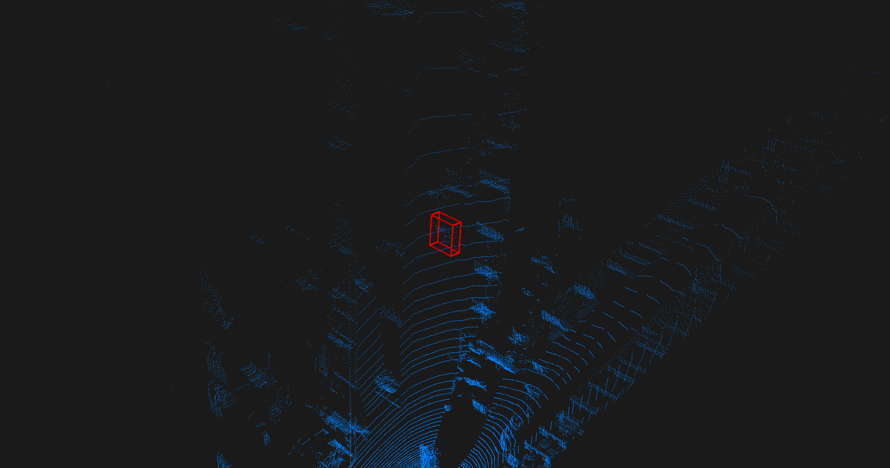

The movie file contains point cloud sequences. In the movie file, the target moves across the point cloud sequences with the corresponding ground truth bounding box (in red color) and the predicted bounding box (in green color). For better visibility of the target, we utilize a black background with a light blue foreground.

