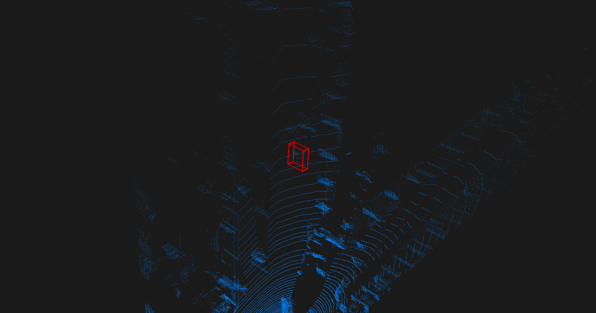
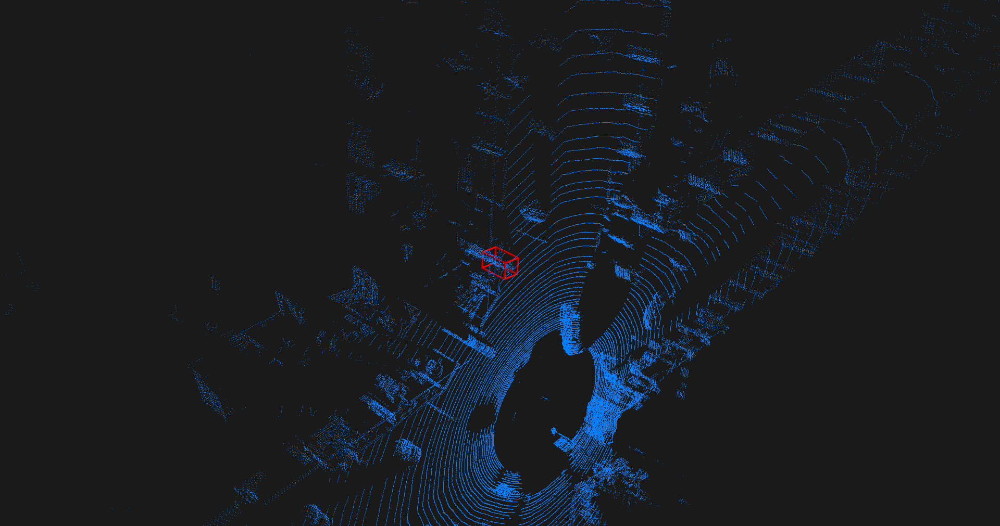

The movie file contains point cloud sequences. In the movie file, the target moves across the point cloud sequences with the corresponding ground truth bounding box (in red color) and the predicted bounding box (in green color). For better visibility of the target, we utilize a black background with a light blue foreground.

**Cyclist Category of KITTI dataset**

**Pedestrian Category of KITTI dataset**

**Van Category of KITTI dataset (149 frames)** 

.gif)

**Car Category of KITTI dataset (89 frames)** 

.gif)

**Large Movie file: Click on the GIF file to play the video**

**Van Category of KITTI dataset (286 frames)** 

.gif)

**Car Category of KITTI dataset (316 frames)** 

.gif)
